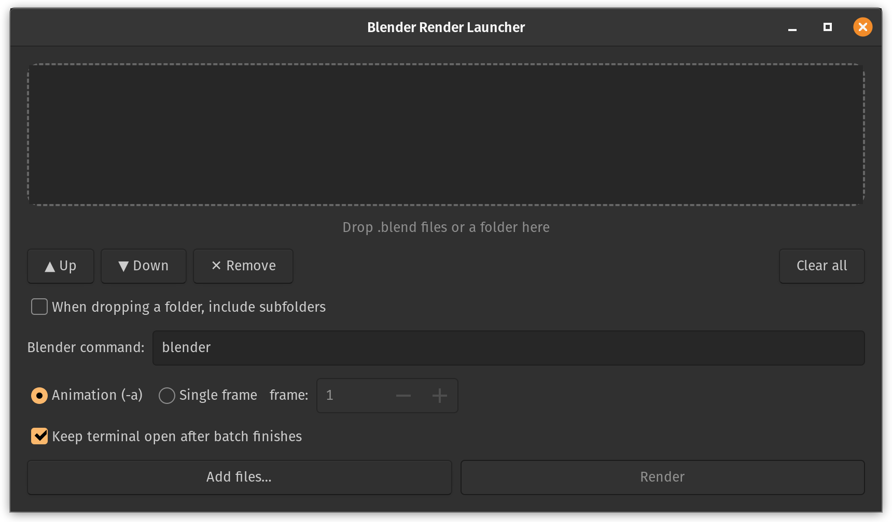

# Blender Render Launcher

A tiny drag-and-drop launcher for **terminal renders** in Blender, built for
Pop!_OS and other GNOME-based Linux desktops.

Rendering from the terminal is faster than the GUI, but starting one means
hunting for the command, opening the right folder, and typing it all out every
time. This app removes that friction: drop one or more `.blend` files (or a
whole folder of them) into the queue, click **Render**, and it runs each one
in turn in a real terminal window so you can watch the progress exactly as you
would by hand.

Blender has no built-in render queue, so batches run sequentially — each file
as its own terminal render, one after another. If a file fails, the batch
carries on and you get a summary popup at the end listing what succeeded and
what failed, which is handy for unattended overnight queues.



## Features

- **Batch queue** — drop multiple `.blend` files, or a folder, and render them one after another
- Reorder and remove files in the queue before you hit render, or strip out accidental duplicates with **Remove duplicates**
- Hover any queued file to see its full path
- A live progress label (`Rendering… 3/7 done`) tracks the batch in the app window while the terminal runs
- Drop a folder to add every `.blend` inside it, with an optional **include subfolders** toggle
- **Skip-on-failure with a summary** — if one file errors the batch keeps going, then a popup tells you what succeeded, what failed, and the exit code, so you can re-render or fix it in Blender
- Choose between rendering the full **animation** (`-a`) or a **single frame** (`-f`)
- **Resume from a frame** — pick up an interrupted animation by starting it from a chosen frame (single file at a time)
- Renders run from each `.blend` file's own folder, so relative output paths behave as expected
- Remembers your Blender command and last-used options between sessions
- Auto-detects your terminal (gnome-terminal, GNOME Console, cosmic-term, tilix, konsole, xterm)
- No third-party dependencies — just Python and GTK, which ship with Pop!_OS

## Requirements

- A GNOME-based Linux desktop (built and tested on Pop!_OS)
- Python 3 with GTK 3 bindings (PyGObject)
- Blender installed and runnable from the command line

If you ever see `No module named 'gi'`, install the GTK bindings:

```bash
sudo apt install python3-gi gir1.2-gtk-3.0
```

## Install

Clone the repository and run the installer:

```bash
git clone https://github.com/<yourusername>/blender-render-launcher.git
cd blender-render-launcher
chmod +x install.sh
./install.sh
```

The installer copies the app into your user folders, registers the icon, and
generates a desktop entry with the correct path for your machine. After it
finishes, open your applications menu (Super key), search for "Blender Render
Launcher", then right-click it and choose **Add to Favourites** to pin it to
your dock.

## Usage

1. Launch the app from your dock or applications menu.
2. Add files to the queue: drag `.blend` files or a folder into the window, or
   use **Add files…**. Drop more at any time to grow the queue. (Dropping a
   folder adds every `.blend` inside it; tick **include subfolders** first if
   you want it to dig into nested folders.)
3. Reorder with **▲ Up** / **▼ Down**, or prune with **✕ Remove** — handy when a
   folder pulled in more than you meant.
4. Choose **Animation** (renders the full frame range) or **Single frame**.
5. Click **Render**. A terminal opens and works through the queue top to bottom,
   showing a `[2/5] Rendering scene.blend` header before each file.

### Resuming an interrupted render

If an animation stopped partway (you logged out, the machine rebooted, etc.),
you can pick it up where it left off: queue just that one file, tick **Resume
from frame** and set the frame to start from. It renders the animation from
that frame onward rather than from the beginning. This is a single-file
operation — it deliberately won't run if you've got several files queued, since
starting them all at the same arbitrary frame wouldn't make sense.

When the batch finishes, a popup summarises the run. If everything rendered you
get a simple confirmation; if anything failed, the popup lists each failed file
with its exit code so you can decide whether to re-render it or open it in
Blender to investigate. The batch never stops early on a single failure.

Output location, format, samples and so on are all taken from the settings
saved inside each `.blend` file itself — identical to running the command by hand.

### Using a Flatpak or Snap Blender

If Blender is installed as a Flatpak, replace the text in the "Blender command"
box with:

```
flatpak run org.blender.Blender
```

The app remembers it for next time. For most apt or Snap installs, the default
`blender` works as-is.

## Uninstall

```bash
./uninstall.sh
```

## How it works

The app is a small GTK3 window holding a render queue. When you click Render it
builds a single shell script that renders each queued file in turn — changing
into each file's folder first, running `blender -b file.blend -a`, and capturing
the exit code. That script runs in your terminal so you watch progress live,
while the app quietly watches a small results file the script writes to. Once
every file has reported, the app reads those exit codes back and shows the
summary popup. The renders themselves are unchanged; only the queuing, the
folder scanning, and the reporting are automated.

## License

Released under the MIT License. See [LICENSE](LICENSE).
